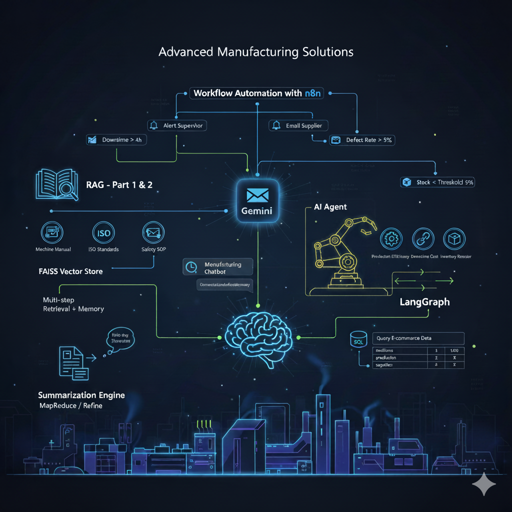

# AI Applications for Manufacturing & Operations


This repository is a **demo project** showcasing multiple AI applications for manufacturing, supply chain, document processing, and workflow automation.  
The project demonstrates **end-to-end AI integration** using **LLMs (Gemini)**, **LangChain**, **LangGraph**, **SQL querying**, **RAG pipelines**, and **workflow automation**.  

---

## 🧩 Project Use Case

The project simulates real-world scenarios in a **manufacturing environment**, with applications that:

- Provide **chatbot assistance** for operators, supervisors, and suppliers.
- Execute **AI agents** capable of multi-step reasoning with external tools.
- Enable **document-based question answering** over manuals, SOPs, and compliance PDFs.
- Query **structured databases** using natural language.
- Summarize **large operational or compliance documents**.
- Automate **alerts, notifications, and workflows** using AI outputs.

This demonstrates a combination of **conversational AI, retrieval-augmented generation (RAG), SQL integration, and workflow automation**.

---

## 📁 Folder Structure

```

MY_PROJ/
├── .venv/                           # Shared Python virtual environment
├── requirements.txt                 # Common dependencies for all tasks
├── Task 1 Chatbot with memory/
├── Task 2 AI Agent with External Tool Access/
├── Task 3 RAG - Part 1 (Basic Document QA)/
├── Task 4 RAG - Part 2 (Memory + Multi-step Retrieval)/
├── Task 5 SQL QA System (E-commerce Data)/
├── Task 6 Summarization Engine/
├── Task 8 Workflow Automation with n8n/  

````

---

## ⚙️ Setup Instructions

1. **Clone the repository:**
```bash
git clone <repository-url>
cd MY_PROJ
````

2. **Create and activate the virtual environment:**

```bash
python -m venv .venv
# Mac/Linux
source .venv/bin/activate
# Windows (PowerShell)
.venv\Scripts\activate
```

3. **Install dependencies:**

```bash
pip install -r requirements.txt
```

---

## 📝 Task Breakdown

| Task   | Description                                  | Key Tools / Libraries                         | Status        |
| ------ | -------------------------------------------- | --------------------------------------------- | ------------- |
| Task 1 | Manufacturing Chatbot with Memory            | Gemini, LangChain, ConversationBufferMemory   | ✅ Completed   |
| Task 2 | AI Agent with External Tool Access           | LangGraph, LangChain Tools, Gemini            | ✅ Completed   |
| Task 3 | RAG - Part 1 (Basic Document QA)             | FAISS, LangChain, Google Vertex AI Embeddings | ✅ Completed   |
| Task 4 | RAG - Part 2 (Memory + Multi-step Retrieval) | MultiQueryRetriever, LangChain, Gemini        | ✅ Completed   |
| Task 5 | SQL QA System (E-commerce Data)              | SQLite, LangChain SQLDatabaseChain, Gemini    | ✅ Completed   |
| Task 6 | Summarization Engine                         | PyPDF, LangChain Summarization Chains, Gemini | ✅ Completed   |
| Task 8 | Workflow Automation with n8n                 | n8n.io, Webhooks, Slack, Gmail                | ✅ Completed |

---

## 🚀 How to Run Each Task

1. **Activate the shared virtual environment:**

```bash
source .venv/bin/activate  # (Windows: .venv\Scripts\activate)
```

2. **Run a specific task:**

```bash
cd "Task 1 Chatbot with memory"
streamlit run app.py
```

> Replace the folder name for the task you want to run. Stop each app with `Ctrl + C` before switching.

---

## 📚 References

* [LangChain Documentation](https://python.langchain.com/docs/introduction/)
* [Gemini API Setup](https://aistudio.google.com/apikey)
* [LangGraph Docs & Playlist](https://docs.langgraph.io/)
* [FAISS + LangChain RAG](https://python.langchain.com/docs/integrations/vectorstores/)
* [LangChain SQL Integration](https://python.langchain.com/docs/integrations/vectorstores/google_cloud_sql_mysql)
* [n8n Documentation](https://docs.n8n.io/)

---