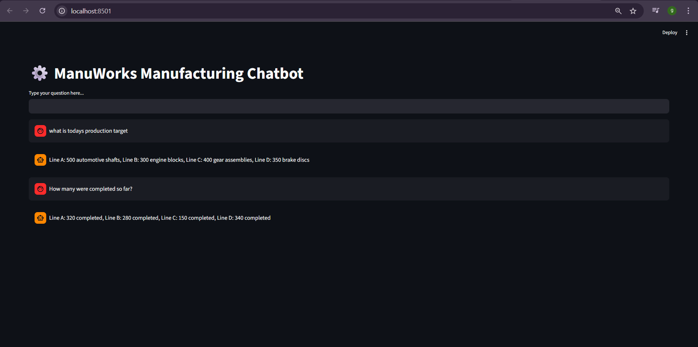

# ⚙️ Task 1 – Manufacturing Chatbot with Memory

### 🧠 Overview
Part of the **ManuWorks AI Suite**, this task demonstrates an **AI-powered chatbot** for manufacturing operations.  
The chatbot assists **operators, supervisors, and suppliers** by answering production-related questions and retaining conversational memory for smooth interactions.

---

### 📂 Folder Contents
```

Task 1 Chatbot with Memory/
├── app.py                    # Main Streamlit app
├── .env                      # Stores GOOGLE_API_KEY
├── README.md                 # Documentation (this file)
└── ManuWorks Chatbot.pdf                # Example chatbot Q&A interactions

````

---

### ⚙️ Tech Stack
- **Frontend:** Streamlit  
- **LLM:** Gemini Pro via `langchain_google_genai`  
- **Framework:** LangChain + ConversationBufferMemory  
- **Environment:** Python `.env` for API keys  
- **Language:** Python 3.10+  

---

### 🚀 Setup & Run Instructions
1. Activate your virtual environment:
```bash
# Windows PowerShell
.venv\Scripts\activate

# Mac/Linux
source .venv/bin/activate
````

2. Install dependencies from the root project:

```bash
pip install -r requirements.txt
```

3. Ensure `.env` contains your API key:

```bash
GOOGLE_API_KEY=your_api_key_here
```

4. Run the Streamlit app:

```bash
cd "Task 1 Chatbot with Memory"
streamlit run app.py
```

---

### 🧩 Requirements (for standalone use)

If you want to run **only Task 1** without the full project:

* **Python version:** 3.10+
* **Dependencies:**

```bash
pip install streamlit langchain langchain_google_genai google-generativeai python-dotenv
```

* **Environment Variable:** `.env` with your Gemini API key:

```bash
GOOGLE_API_KEY=your_api_key_here
```

---

### 💬 Example Interactions

The chatbot can answer queries like:

**Operator:** “What’s today’s production target?”
**Bot:** “Line A: 500 automotive shafts, Line B: 300 engine blocks, Line C: 400 gear assemblies, Line D: 350 brake discs.”

**Operator:** “How many are completed so far?”
**Bot:** “Line A: 320 completed, Line B: 280 completed, Line C: 150 completed, Line D: 340 completed.”

---

### 🧠 What This Task Demonstrates

* ✅ LangChain memory modules for context retention (`ConversationBufferMemory`)
* ✅ Integration of Gemini Pro API for natural, contextual replies
* ✅ Building an interactive AI assistant using Streamlit
* ✅ Structuring conversational workflows with prompt templates

---

### 📸 Screenshots



---

### 🪄 Future Enhancements

* Add role-based access (operator/supervisor/supplier)
* Connect to real-time factory databases for live data
* Enhance memory with summarization for long sessions