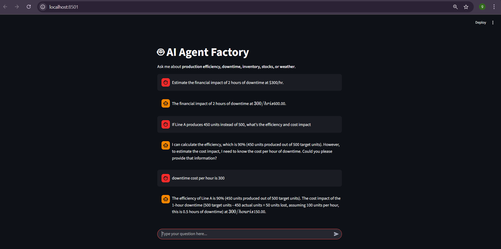
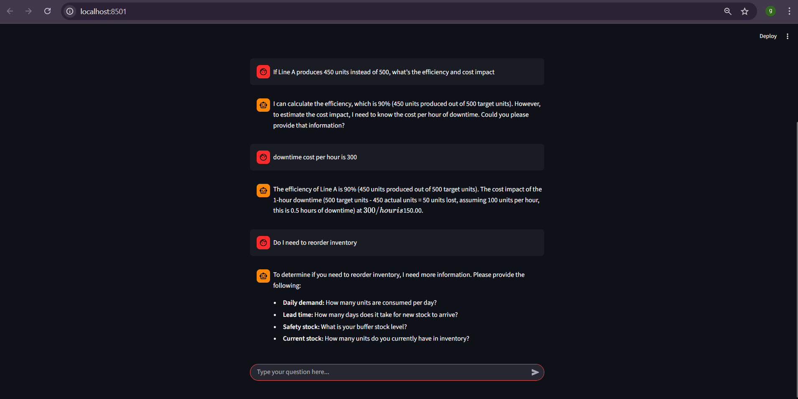

# 🤖 Task 2 – AI Agent with External Tool Access

### 🧠 Overview
This task is part of the **ManuWorks AI Suite** and demonstrates an **AI agent** capable of multi-step reasoning and tool usage.  
The agent assists in **production efficiency, downtime estimation, inventory checks, stock prices, and weather queries**, using a combination of **LangGraph**, **LangChain**, and **Gemini Pro**.

---

### 📂 Folder Contents
```

Task 2 AI Agent with External Tool Access/
├── app.py                    # Main Streamlit interface
├── agent.py                  # LangGraph agent logic
├── prompts/                  # Prompt templates
│   └── prompts.py
├── tools/                    # Custom tools for the agent
│   ├── api_tools.py          # Stock & weather API tools
│   ├── downtime.py           # Downtime cost tool
│   ├── efficiency.py         # Efficiency calculation tool
│   └── inventory.py          # Inventory reorder tool
├── .env                      # Stores API keys (Gemini, Alpha Vantage, OpenWeather)
└── README.md                 # Documentation (this file)

````

---

### ⚙️ Tech Stack
- **Frontend:** Streamlit  
- **Agent Orchestration:** LangGraph  
- **LLM:** Gemini Pro via `langchain_google_genai`  
- **Framework:** LangChain for tools & prompt templates  
- **Tools Included:** Efficiency, Downtime, Inventory, Stock API, Weather API  
- **Environment:** Python `.env` for API keys  
- **Language:** Python 3.10+  

---

### 🚀 Setup & Run Instructions
1. Activate your virtual environment:
```bash
# Windows PowerShell
.venv\Scripts\activate

# Mac/Linux
source .venv/bin/activate
````

2. Install dependencies from the root project:

```bash
pip install -r requirements.txt
```

3. Ensure `.env` contains your API keys:

```bash
GEMINI_API_KEY=your_gemini_key_here
ALPHA_VANTAGE_API_KEY=your_alpha_vantage_key_here  
OPENWEATHER_API_KEY=your_openweather_key_here     
```

4. Run the Streamlit app:

```bash
cd "Task 2 AI Agent with External Tool Access"
streamlit run app.py
```

---

### 🧩 Requirements (for standalone use)

If you want to run **only Task 2** without the full project:

* **Python version:** 3.10+
* **Dependencies:**

```bash
pip install streamlit langchain langgraph langchain_google_genai google-generativeai python-dotenv requests
```

* **Environment Variables (.env):**

```bash
GEMINI_API_KEY=your_gemini_key_here
ALPHA_VANTAGE_API_KEY=your_alpha_vantage_key_here  
OPENWEATHER_API_KEY=your_openweather_key_here    
```

> Note: If `ALPHA_VANTAGE_API_KEY` or `OPENWEATHER_API_KEY` is not provided, the agent will use **mocked responses** for testing.

---

### 💬 Example Interaction

The agent can handle multi-step queries using **ReAct reasoning** with tools:

1. **Query:** "Line A produced 450 units instead of 500, what is the efficiency and cost impact?"
   **Process:** Efficiency Tool → Downtime Tool → Final Answer

2. **Query:** "Do I need to reorder inventory if daily demand is 100, lead time 5 days, safety stock 200, and current stock is 650?"
   **Process:** Inventory Tool → Final Answer

3. **Query:** "What is Tesla's current stock price and the weather in Berlin?"
   **Process:** Stock API Tool → Weather API Tool → Final Answer

---

### 🧠 What This Task Demonstrates

* ✅ Multi-step reasoning using **LangGraph**
* ✅ Integration of **LangChain tools** with LLM for real-world calculations
* ✅ Handling external API calls (Stock & Weather)
* ✅ Structured ReAct-style reasoning (`Thought → Action → Observation → Final Answer`)
* ✅ Building an interactive AI agent using Streamlit

---

### 📸 Screenshots




---

### 🪄 Future Enhancements

* Add more specialized tools for production, inventory, or finance
* Integrate real-time manufacturing data streams
* Add conversational memory across sessions
* Enhance error handling and fallback logic for API failures