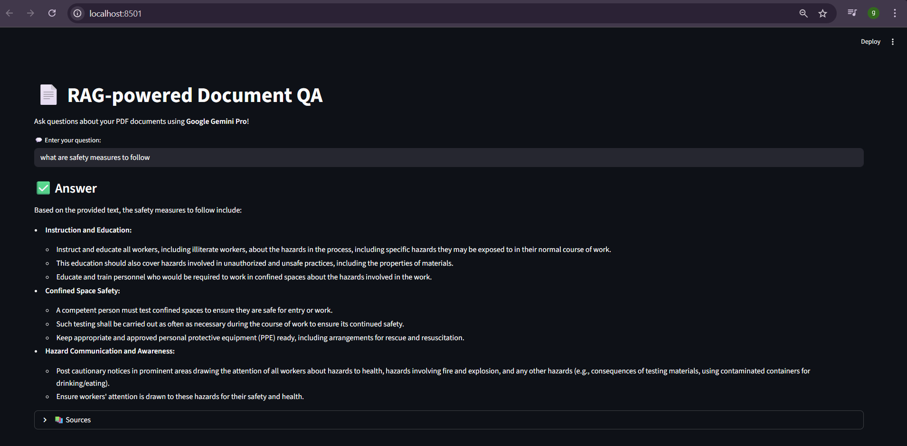

# 📄 Task 3 – RAG-Based Document QA (Basic Document QA)

### 🧠 Overview
This task is part of the **ManuWorks AI Suite** and demonstrates a **Retrieval-Augmented Generation (RAG) system**.  
It allows users to **ask questions over PDFs**, such as SOPs, machine manuals, or ISO standards, using **Google Gemini Pro** models and **FAISS** for vector search.  

The system is built with **LangChain** and provides a simple **Streamlit UI** for interactive Q&A.

---

### 📂 Folder Contents
```

Task 3 RAG - Part 1 (Basic Document QA)/
├── app.py                     # Streamlit app entry point
├── configs/
│   └── settings.yaml          # Configuration for PDF path, index path, model, etc.
├── data/
│   └── SOP_Hazardous_Processes.pdf  # Example PDF document
├── index/                     # FAISS index folder
├── src/
│   ├── config.py              # Load YAML config
│   ├── loader.py              # PDF loading and splitting
│   ├── embedder.py            # FAISS index creation/loading
│   ├── retriever.py           # Vectorstore -> retriever
│   └── qa_system.py           # Gemini Pro LLM wrapper + RetrievalQA chain           
└── vectorstore.pkl           # Optional cached vectorstore

````

---

### ⚙️ Tech Stack
- **Frontend:** Streamlit  
- **LLM:** Google Gemini Pro via `google-generativeai`  
- **Framework:** LangChain + `langchain_community`  
- **Vector Store:** FAISS (`faiss-cpu`)  
- **Embeddings:** `sentence-transformers` (`all-MiniLM-L6-v2`)  
- **PDF Handling:** `pypdf`  
- **Configuration:** YAML files (`pyyaml`)  
- **Language:** Python 3.10+  

---

### 🚀 Setup & Run Instructions
1. Activate your virtual environment:
```bash
# Windows PowerShell
.venv\Scripts\activate

# Mac/Linux
source .venv/bin/activate
````

2. Install dependencies:

```bash
pip install -r requirements.txt
```

3. Edit the configuration `configs/settings.yaml` if needed:

```yaml
pdf_path: "data/SOP_Hazardous_Processes.pdf"
index_path: "index/sop_faiss_index"
chunk_size: 500
chunk_overlap: 100
retrieval_k: 3
llm_model: "gemini-2.5-flash"
```

4. Run the Streamlit app:

```bash
cd "Task 3 RAG - Part 1 (Basic Document QA)"
streamlit run app.py
```

5. Enter your question in the input field.
   The system will display:

   * Generated **answer**
   * Expandable **source documents** used for retrieval

⚡ **Note:** The first run may take longer as PDFs are loaded, split, and indexed. Subsequent queries are faster thanks to caching.

---

### 🧩 Requirements (for standalone use)

If you want to run **only Task 3** without the full project:

* **Python version:** 3.10+
* **Dependencies:**

```bash
pip install streamlit langchain langchain_community faiss-cpu sentence-transformers transformers pypdf pyyaml google-generativeai tqdm
```

* **Environment Variables (.env):**
  Only needed if you use `google-generativeai` API key for Gemini:

```bash
GOOGLE_API_KEY=your_api_key_here
```

---

### 💬 Example Interaction

The system allows queries related to the document used:

* "What are the safety steps before operating the CNC machine?"
* "List the compliance requirements for hazardous processes."
---

### 📸 Screenshots



---

### 🧠 What This Task Demonstrates

* ✅ RAG pipeline using **FAISS + LangChain**
* ✅ Embeddings and vector search for fast retrieval
* ✅ Integration of **Gemini Pro LLM** for document-based answers
* ✅ Interactive Streamlit UI with expandable sources
* ✅ Caching vectorstore to speed up repeated queries

---

### 🪄 Future Enhancements

* Support multiple PDFs loaded simultaneously
* Add conversational memory for multi-turn document QA
* Improve ranking of retrieved documents
