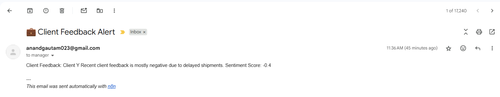
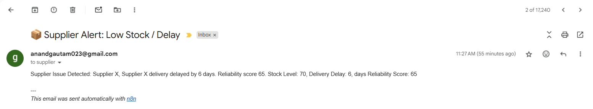
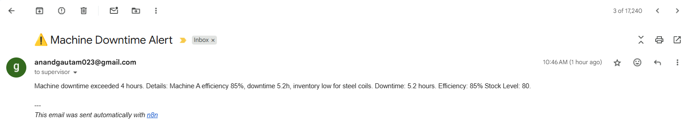

## 🧩 Task 8 — Automated Alert Workflow using n8n

### 📘 Overview

This workflow automates alerts and reporting by connecting multiple AI agents and data systems using **n8n**.
It listens to incoming JSON payloads from various AI modules (e.g., production monitoring, supplier analysis, client sentiment) and takes automatic actions — such as logging data to Google Sheets and emailing supervisors when specific conditions are met.

---

### ⚙️ Workflow Components

#### **1️⃣ Webhook Node**

* **Purpose:** Entry point of the workflow.
* **Input:** Receives JSON payloads via HTTP POST requests.
* **Example Payloads:**

  * **AI Agent (Production):**

    ```json
    {
      "source": "AI Agent",
      "summary": "Machine A efficiency 85%, downtime 5.2h, inventory low for steel coils.",
      "downtime_hours": 5.2,
      "efficiency": 85,
      "stock_level": 80,
      "supervisor_email": "supervisor@example.com",
      "analysis_type": "Production Report"
    }
    ```

    **Condition:** `Downtime > 4 → Email Supervisor`

  * **SQL QA System (Suppliers):**

    ```json
    {
      "source": "SQL QA System",
      "summary": "Supplier X delivery delayed by 6 days. Reliability score 65.",
      "supplier_name": "Supplier X",
      "delivery_delay_days": 6,
      "reliability_score": 65,
      "stock_level": 70,
      "supplier_email": "supplier@example.com",
      "analysis_type": "Supplier Report"
    }
    ```

    **Condition:** `Stock < 100 OR delivery_delay_days > 5 → Email Supplier`

  * **Sentiment Summarizer (Client Feedback):**

    ```json
    {
      "source": "Sentiment Summarizer",
      "summary": "Recent client feedback is mostly negative due to delayed shipments.",
      "client_id": 101,
      "client_name": "Client Y",
      "sentiment_score": -0.4,
      "client_manager_email": "manager@example.com",
      "analysis_type": "Sentiment Analysis"
    }
    ```

    **Condition:** `Sentiment Score < 3 → Email Client Manager`

---

#### **2️⃣ Switch Node**

* **Purpose:** Routes each incoming payload based on its `source` field.
* **Rules:**

  * Matches regex:

    * `"AI Agent"`
    * `"SQL QA System"`
    * `"Sentiment Summarizer"`

Each output path is connected to its respective **IF condition node**.

---

#### **3️⃣ IF Condition Nodes**

* Evaluate logical rules for each data type:

  * **AI Agent Path:** Check if `downtime_hours > 4`
  * **SQL QA Path:** Check if `stock_level < 100 OR delivery_delay_days > 5`
  * **Sentiment Path:** Check if `sentiment_score < 3`

If true, it triggers Google Sheet logging and email notifications.

---

#### **4️⃣ Google Sheets Nodes**

* **Purpose:** Log alert details for tracking.
* **Sheets Used:**

  * `AI_Agent_Alerts`
  * `SQL_QA_Alerts`
  * `Sentiment_Alerts`
* Each sheet contains structured alert data (timestamp, summary, key metrics, contact email).

---

#### **5️⃣ Gmail Nodes**

* **Purpose:** Send automatic alert emails.
* **Recipients:**

  * Supervisor → AI Agent alerts
  * Supplier → SQL QA alerts
  * Client Manager → Sentiment alerts

Each email includes:

* Summary of the issue
* Key metrics triggering the alert
* Link/reference for detailed logs

---

### 🧠 Workflow Logic Summary

| Source Type              | Condition Trigger             | Action                                          |
| ------------------------ | ----------------------------- | ----------------------------------------------- |
| **AI Agent**             | Downtime > 4                  | Log to `AI_Agent_Alerts`, email Supervisor      |
| **SQL QA System**        | Stock < 100 or Delay > 5 days | Log to `SQL_QA_Alerts`, email Supplier          |
| **Sentiment Summarizer** | Sentiment < 3                 | Log to `Sentiment_Alerts`, email Client Manager |

---

### 🧾 Workflow Diagram

*(Reference: Workflow Screenshot)*


---

### 🧾 Email Screenshots

*(Reference: Email Screenshot)*




---

### 🧾 Google Sheet Link
https://docs.google.com/spreadsheets/d/1IRfIZ-BhQyDE2rz8wHuMFArEDCxcurpNtiXEBFbhrYI/edit?usp=sharing

--- 

### 🛠️ Requirements (for standalone use)

If this workflow is used independently (outside the full project):

* A running **n8n instance** (local or cloud)
* Connected **Google Sheets** and **Gmail** credentials
* Valid webhook URL (auto-generated by n8n)
* (Optional) Environment variables for API keys if integrated with external systems

---

### ✅ Execution Steps

1. Import this workflow JSON into **n8n**.
2. Connect your **Google Sheets** and **Gmail** accounts.
3. Deploy the **Webhook** node and copy its URL.
4. Configure your AI agents or systems to send POST requests to this webhook.
5. Trigger your agents — alerts will automatically appear in the sheets and inbox.

---

### 📂 Folder Structure

```
Task 8 - Automated Alert Workflow/
│
├── workflow_screenshot.png
├── README.md
└── n8n_workflow.json
```


